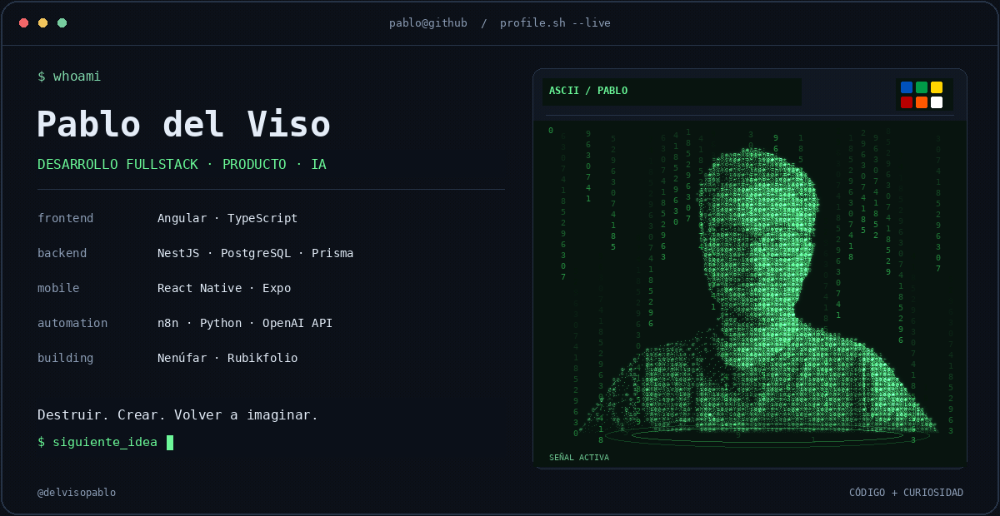

### Código, ideas y unas cuantas piezas por encajar.

[LinkedIn](https://linkedin.com/in/pablodelvisogomez) · [Hablemos](mailto:delvisogomezpablo@gmail.com) · [Mis repositorios](https://github.com/delvisopablo?tab=repositories)

---

## Hola, soy Pablo 👋

Me gusta convertir ideas en cosas que se puedan usar. Combino **ADE Tecnológico y formación en Informática** para conectar la parte técnica con el negocio: entender el problema, diseñar la solución y construirla de principio a fin.

- Desarrollo **Nenúfar**, una plataforma para descubrir negocios locales con reseñas y gamificación.
- Me divierte crear interfaces con personalidad: desde un portfolio con forma de **cubo de Rubik** hasta juegos sobre Pokémon.
- Trabajo con **IA y automatización**, integrando APIs y flujos con n8n para simplificar tareas.
- Me gusta conectar las piezas: frontend, backend, bases de datos y despliegue.
- Fuera del código: cine, series, videojuegos y cacharrear con Raspberry Pi.

## Mi caja de herramientas

| Área | Tecnologías y herramientas |
| :--- | :--- |
| **Frontend y móvil** | Angular · TypeScript · React Native · Expo |
| **Backend y datos** | NestJS · Node.js · PostgreSQL · Prisma · API REST · JWT |
| **IA y automatización** | OpenAI API · n8n · Python · Integración de APIs |
| **Interfaces y movimiento** | Figma · Anime.js · Three.js · GSAP |
| **Entrega e integraciones** | Git · GitHub · Vercel · Railway · Docker · Postman |
| **Web3 y hardware** | Solidity · Ethereum Sepolia · ethers.js · NFC · Raspberry Pi |

## Proyectos con los que voy encajando piezas

| Proyecto | Qué estoy construyendo | Piezas principales |
| :--- | :--- | :--- |
|  [Nenúfar] (https://github.com/delvisopablo/nenufar) | Descubrimiento de negocios locales, reseñas y gamificación. | Angular · NestJS · PostgreSQL |
|  [Rubikfolio] (https://github.com/delvisopablo/pablodelviso-folio) | Un portfolio interactivo inspirado en un cubo de Rubik, con navegación y animaciones 3D. | Interfaces · Anime.js · Interacción 3D |
|  [PokeListillos] (https://github.com/delvisopablo/PokeListillos)  | Pokédex, juego de adivinar Pokémon y ranking de jugadores. | Angular · API REST · Gamificación |
|  Casita  | Una aplicación móvil (aún en desarrollo) de presencia familiar mediante NFC. | React Native · Expo · NestJS · NFC |
|  [RecycleToken] (https://github.com/delvisopablo/proyecto-baterias) | Un proyecto de token ERC-20 en la red de pruebas Sepolia. | Solidity · NestJS · Angular · MetaMask |

Los enlaces de código apuntan a repositorios públicos; algunos proyectos todavía no tienen código público enlazado.

## Cómo me gusta trabajar

**Entender el problema → Diseñar algo útil → Construirlo → Probarlo → Mejorarlo.**

Me interesa tanto cómo funciona una aplicación como por qué alguien querría usarla. Disfruto uniendo desarrollo, experiencia de usuario y visión de negocio, con espacio para experimentar por el camino.

---

### ¿Tienes una idea que merece salir del bloc de notas?

Hablemos de desarrollo, automatización o de ese proyecto que llevas tiempo queriendo montar.

**[LinkedIn](https://linkedin.com/in/pablodelvisogomez) · [delvisogomezpablo@gmail.com](mailto:delvisogomezpablo@gmail.com)**

Hecho con curiosidad y ganas de encajar la siguiente pieza.

<!-- Inspiración de formato: https://github.com/emmi-lili/emmi-lili.
     Textos y gráficos originales para Pablo del Viso. -->
